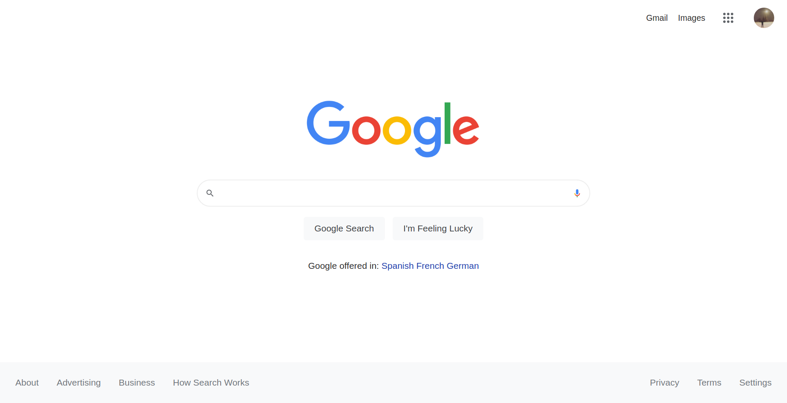

# Google Homepage

This is the Google Homepage clone project which is part of the [foundations
course of The Odin Project](https://www.theodinproject.com/paths/foundations/courses/foundations).

## Goals
- Create a clone of the google homepage
- Make sure the design is nearly the same as the original

## Final Result

## Notes
- The search button actually makes a Google Search
- The "I'm Feeling Lucky" button animates the Google logo

**Warning**: This website is completely broken on mobile and not responsive at all.
